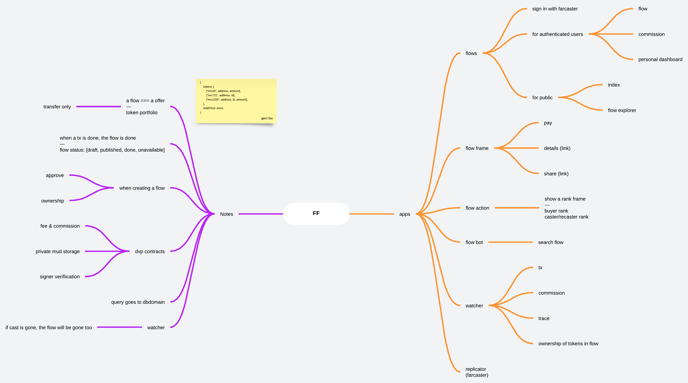
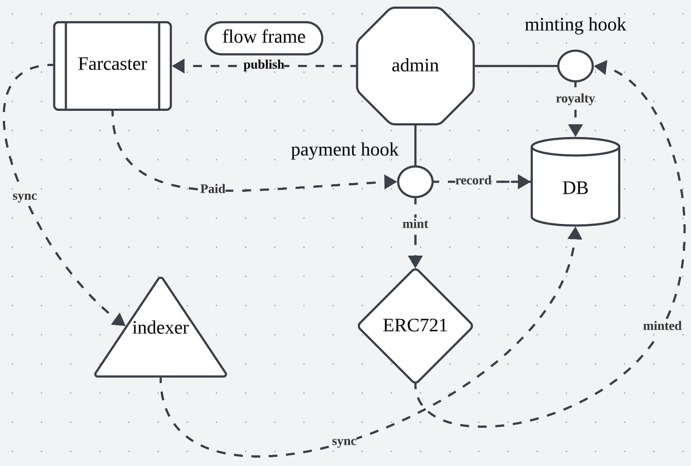
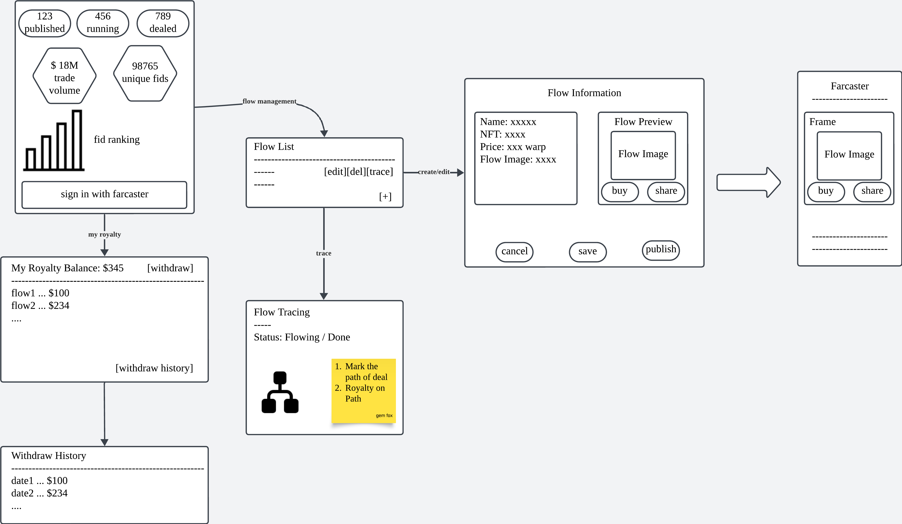

# Farcaster Flow

## Introduction



The directories:

- frame, farcaster frame
- indexer, farcaster replicator
- web, flow  admin web site

## Architecture



## Basic UI Flow



## Run

```sh
cp .env.example .env
docker-compose up -d --build
```
